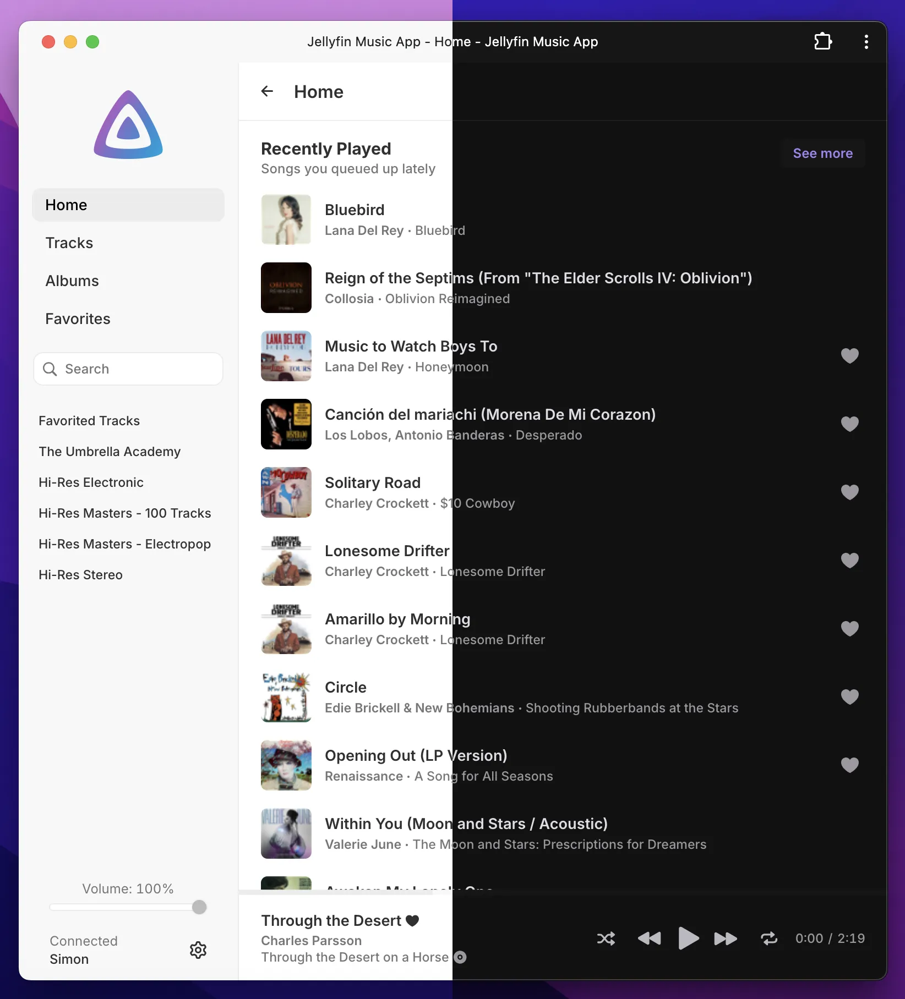
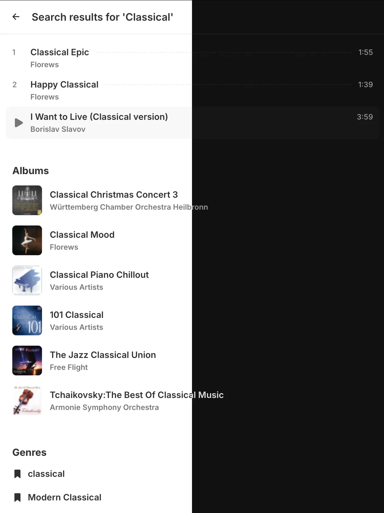
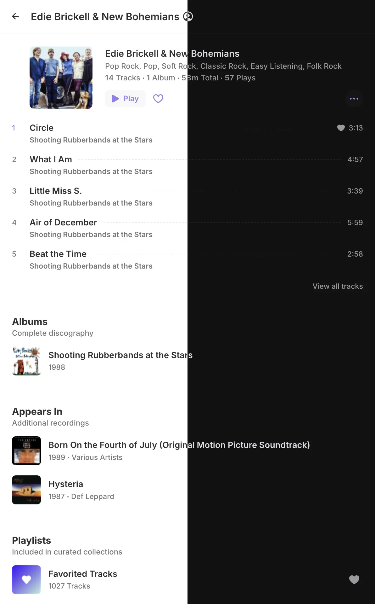
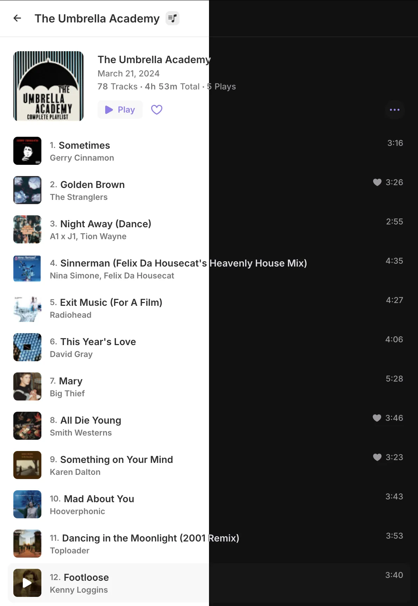

## Jelly Music App (JMA)

A lightweight & elegant music interface for Jellyfin. Made to be intuitive and minimal with great attention to detail, a clutter-free web app centered on music playback. Using the Jellyfin API, it provides seamless access to your personal music library.
 

  
  
  
  

  
  
  
  
  

 
Jelly Music App is licensed under the MIT license.
